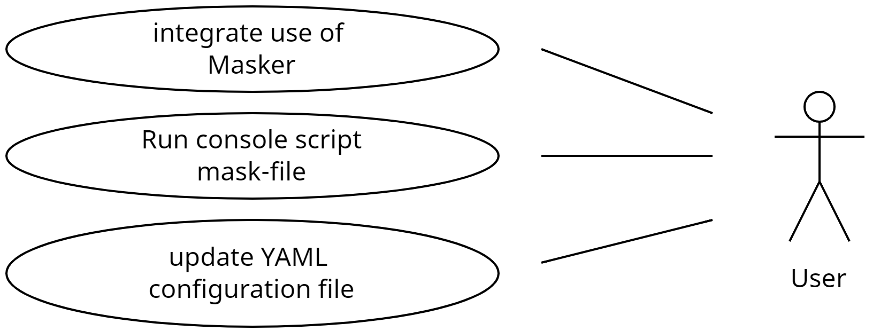
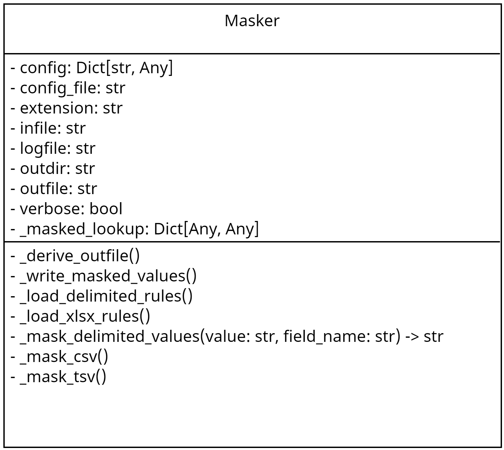

# phi-masker-utils

Collection of Python modules for masking PHI in delimited files and Excel worksheets.

- [phi-masker-utils](#phi-masker-utils)
  - [Improvements](#improvements)
  - [Use Cases](#use-cases)
  - [Class Diagram](#class-diagram)
  - [Installation](#installation)
  - [Exported Scripts](#exported-scripts)
  - [Usage](#usage)
  - [Contributing](#contributing)
  - [To-Do/Coming Next](#to-docoming-next)
  - [CHANGELOG](#changelog)
  - [License](#license)


## Improvements

Please see the [TODO](docs/TODO.md) for a list of upcoming improvements.

## Use Cases



## Class Diagram



## Installation

Please see the [INSTALL](docs/INSTALL.md) guide for instructions.

## Exported Scripts

* mask-file

## Usage

```python
from phi_masker_utils import Masker

config_file = "conf/config.yaml"
config = yaml.safe_load(Path(config_file).read_text())

# Tab-delimited file
infile = "my.tsv"
outfile = "my_masked.tsv"

# Or comma-separated file
infile = "my.csv"
outfile = "my_masked.csv"

masker = Masker(
    config=config,
    config_file=config_file,
    infile=infile,
    logfile=logfile,
    outdir=outdir,
    outfile=outfile,
    verbose=verbose,
)

masker.mask_phi_values()
```

## Contributing

Pull requests are welcome. For major changes, please open an issue first
to discuss what you would like to change.

## To-Do/Coming Next

Please view the listing of planned improvements [here](docs/TODO.md).

## CHANGELOG

Please view the CHANGELOG [here](docs/CHANGELOG.md).

## License

[GNU AFFERO GENERAL PUBLIC LICENSE](docs/LICENSE)
